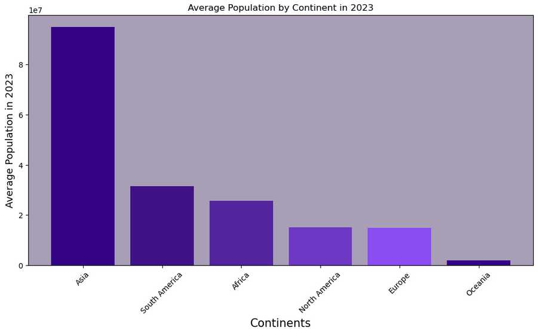

# World Population Analysis

## Business Understanding
### The objective of this data science project is :
<ul>
  <li>To analyze global population trends and understand their potential socioeconomic implications using a comprehensive dataset</li>
</ul>

 

## Data Understanding
 The datasets is obtained from The World Bank website <a href="https://data.worldbank.org/indicator/SP.POP.TOTL">Population</a> The dataset contains information about the population of various countries over several continents.
Columns of the population dataset include
<ul>
  <li><code>Country</code> : The name of country.</li>
  <li><code>Continent</code> : The name of continent.</li>
  <li><code>2023 Population</code> : The population of specific region or country.</li>
</ul>

 

## Analysis

## Author
### Tushar Mukherjee 

<a href="mailto: mukherjeetushar78@gmail.com">E-mail</a> || <a href="https://www.linkedin.com/in/tushar-mukherjee-b8516028a">LinkedIn</a> || <a href="https://github.com/GocoVoid">GitHub</a>
